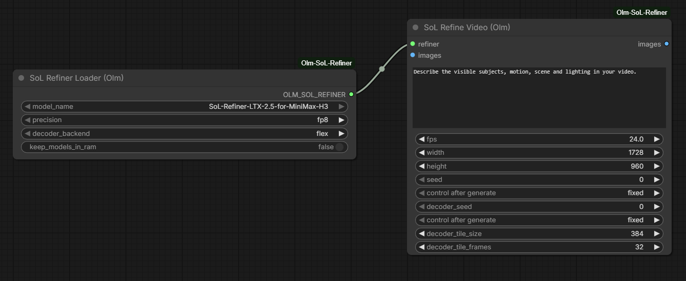
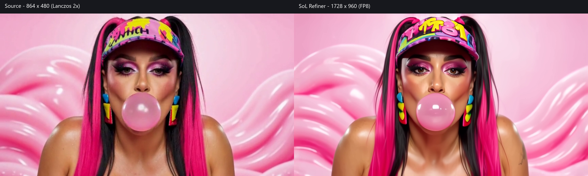

# Olm SoL Refiner for ComfyUI

Experimental ComfyUI nodes for NVIDIA's
[SoL Refiner MiniMax-H3 checkpoint](https://huggingface.co/Efficient-Large-Model/SoL-Refiner-LTX-2.5-for-MiniMax-H3).
Refine and upscale video using decoded frames and a text prompt. Input does not
need to come from LTX, and no MiniMax model or latents are required.

Created by [Olli Sorjonen](https://github.com/o-l-l-i) · [X](https://x.com/Olmirad)



**Experimental:** this is generative refinement, and details can change.
Local tests showed changes to facial features, clothing patterns and jewelry.
Check the result against your source when likeness or detail preservation matters.

## Installation

From your ComfyUI `custom_nodes` directory:

```sh
git clone https://github.com/o-l-l-i/ComfyUI-Olm-SoL-Refiner.git
```

Install dependencies **using your ComfyUI Python environment**, then restart ComfyUI:

```sh
python -m pip install -r ComfyUI-Olm-SoL-Refiner/requirements.txt
```

Tested on Windows with ComfyUI 0.31.0, Python 3.13, PyTorch 2.13 / CUDA 13,
and an RTX 5090 with 32 GB VRAM and 128 GB system RAM. Smaller GPUs and other
operating systems have not been validated. Requirements include a pinned
Diffusers revision and Triton 3.7 for Windows; match Triton to your PyTorch version.

Download the complete
[model repository](https://huggingface.co/Efficient-Large-Model/SoL-Refiner-LTX-2.5-for-MiniMax-H3)
(approximately 71 GB) and keep its folders together:

```text
ComfyUI/models/sol_refiner/SoL-Refiner-LTX-2.5-for-MiniMax-H3/
    model_index.json
    connectors/          diffusion_decoder/    latent_upsampler/
    scheduler/           text_encoder/         tokenizer/
    transformer/         vae/
```

Existing `diffusers` or `sol_refiner` paths in `extra_model_paths.yaml` also
work. Point them at the **parent directory** containing the model folder, for
example:

```yaml
external_models:
  sol_refiner: E:/Models
```

With that example, the model belongs in
`E:/Models/SoL-Refiner-LTX-2.5-for-MiniMax-H3/`. Existing `diffusers` entries
need no additional configuration. The loader lists immediate subfolders whose
names contain `sol` and that contain `model_index.json`; keep the original model
folder name. Restart ComfyUI after changing model paths.

The nodes load local files only and do not modify the weights or download
additional models.

## Usage

Open the [example workflow](workflows/video_refinement.json), select or upload
your video in **Load Video**, and replace the placeholder prompt with a
description of the visible scene and action.

1. **Load Video → Get Video Components** provides frames, audio and FPS.
2. **SoL Refiner Loader (Olm)** selects the model and precision.
3. **SoL Refine Video (Olm)** processes the frames at your chosen output size.
4. **Create Video → Save Video** combines the result with the original audio and FPS.

For an 864 × 480 input, set width and height to **1728 × 960** for 2× output.
The refiner returns a normal `IMAGE` batch; other video-loading and saving nodes
can be used too. Frame count and FPS are preserved. Audio bypasses the model.

| Setting | Notes |
| --- | --- |
| `precision` | Start with `fp8`. `bf16` uses more memory; `nvfp4` is an experimental Blackwell option. Quantization applies to large transformer layers. |
| `decoder_backend` | Use `flex` for the tested Windows setup. First use or new shapes require compilation. `natten` needs a separate installation and is untested here. |
| `keep_models_in_ram` | Off by default. Enable for faster reruns at the cost of keeping tens of GB of CPU weights. |
| Decoder tiles | Smaller tiles can reduce decoder memory, but can affect texture and seams. |
| Seeds | Refinement and decoding have separate noise seeds. |

Models use ComfyUI's memory management and are offloaded between stages and
after execution, including cancellation. The text encoder remains large even
with a quantized transformer. `--novram` is unsupported. Start with a short clip;
compilation and decoding can take considerably longer than the refinement step.

## Example comparison



The middle frame (index 79, 3.292 s) of a 158-frame, 24 fps clip. Left: 864 × 480
source enlarged with Lanczos to match the 1728 × 960 output on the right.
Click the image to inspect it at full size.

Settings: FP8, Flex attention, seeds 0/0, decoder tiles 384 px / 32 frames.
The original text prompt was supplied; the image reference mentioned in that
prompt was not an additional model input. This is one local example, not a
benchmark of the model's overall quality. A still frame does not show temporal
consistency.

## Credits

Model and research: [NVIDIA / SoL Refiner](https://nvlabs.github.io/Sana/Sol-Refiner/).
This is an independent ComfyUI integration. It supports the **LTX-2.5 MiniMax-H3**
package, which is separate from the original paper's LTX-2.3 checkpoints.

See [NVIDIA's H3 instructions](https://github.com/NVlabs/Sana/tree/sol-engine/models/sol-refiner/MiniMax-H3)
and [third-party notices](THIRD_PARTY_NOTICES.md) for source attribution.
Original integration code is covered by [LICENSE.txt](LICENSE.txt), with
Apache-2.0 exceptions for `models.py` and `decoder.py`.
Model weights are not included; their terms are separate from the integration code.
